# Audio Analysis — Bowie Phone Capture

**Duration:** 10.00 seconds  
**Sample Rate:** 22,050 Hz  
**Samples:** 220,500  
**Bit Depth:** 16-bit signed

## Signal Statistics

- **Min:** -17487
- **Max:** 16994
- **Mean:** 63.4
- **Std Dev:** 10097.1
- **Peak Amplitude:** 17487
- **Peak:** -5.5 dBFS
- **RMS Level:** 10097.3
- **RMS:** -10.2 dBFS
- **Clipping:** 0 samples (0.00%)

---

## Audio Waveforms (by second)

### Second 0 (0.0s – 1.0s)
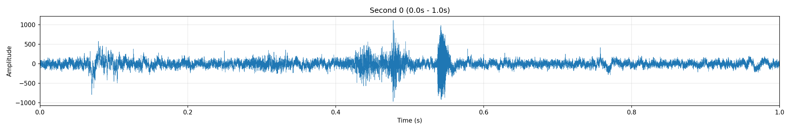

### Second 1 (1.0s – 2.0s)
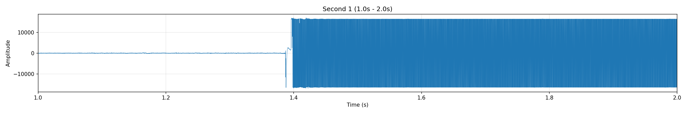

### Second 2 (2.0s – 3.0s)
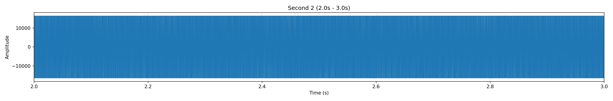

### Second 3 (3.0s – 4.0s)
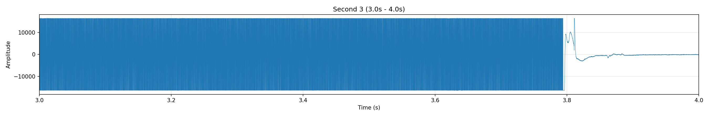

### Second 4 (4.0s – 5.0s)
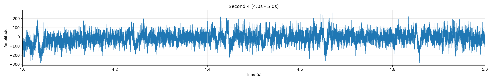

### Second 5 (5.0s – 6.0s)
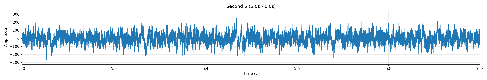

### Second 6 (6.0s – 7.0s)

### Second 7 (7.0s – 8.0s)
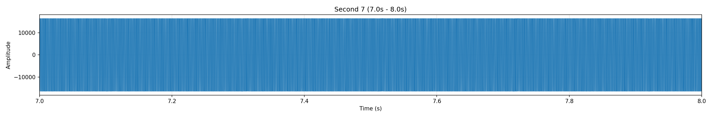

### Second 8 (8.0s – 9.0s)

### Second 9 (9.0s – 10.0s)

---

## Tone Regions Detected

Energy gate threshold: **-20.0 dBFS**  
Active windows: **37** / 79 total

| Region | Start | End | Duration |
|--------|-------|-----|----------|

| 1 | 1.37s | 4.00s | 2.62s |

| 2 | 6.25s | 8.25s | 2.00s |

---

## Spectrum Analysis — Identified Tone Pairs

These spectrum plots show the FFT of the highest-energy window in each tone region with the **actual peak frequencies labeled** in both the low band (650–1000 Hz, blue) and high band (1150–1700 Hz, red). Dotted lines mark the standard DTMF frequencies.

### Tone Region 1 — t=2.50s

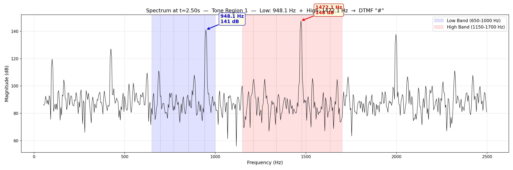

- **Low band peak:** 948.1 Hz (141 dB) → nearest DTMF: 941 Hz (offset: 7.1 Hz)
- **High band peak:** 1472.1 Hz (148 dB) → nearest DTMF: 1477 Hz (offset: -4.9 Hz)
- **Decoded digit:** `#`

### Tone Region 2 — t=6.75s

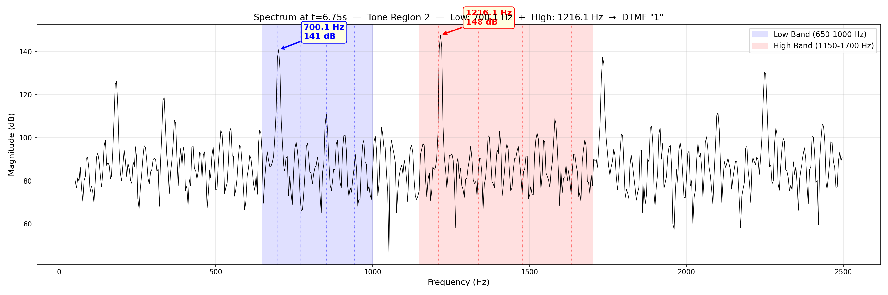

- **Low band peak:** 700.1 Hz (141 dB) → nearest DTMF: 697 Hz (offset: 3.1 Hz)
- **High band peak:** 1216.1 Hz (148 dB) → nearest DTMF: 1209 Hz (offset: 7.1 Hz)
- **Decoded digit:** `1`

---

## Frequency Pair Timeline

Shows the peak frequency in each DTMF band for every analysis window. Color intensity = magnitude. Gray dots are noise windows below the energy gate. DTMF reference frequencies shown as dashed lines.

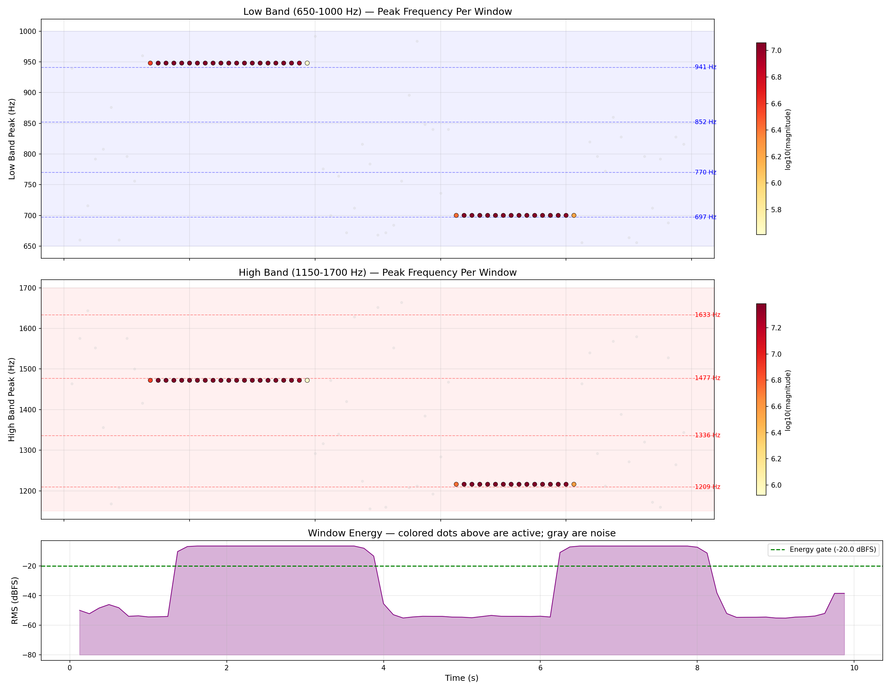

---

## Goertzel Heatmap — All 8 DTMF Frequencies Over Time

Shows the Goertzel filter magnitudes for each of the 8 standard DTMF frequencies across all windows. This is what the firmware detector "sees".

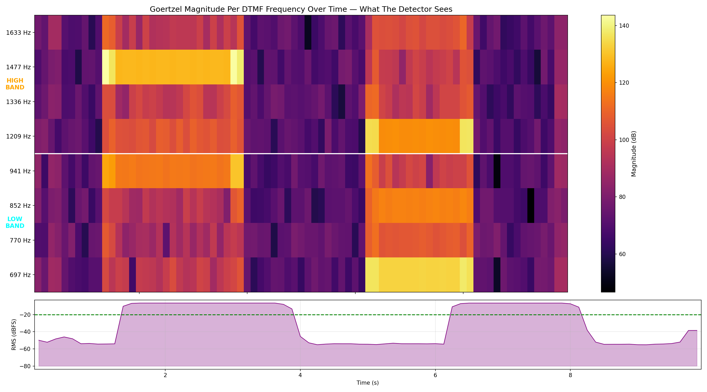

---

## Goertzel Detail — Per Tone Region

Bar charts of all 8 Goertzel magnitudes for the strongest window in each tone region. Blue = low band, red = high band.

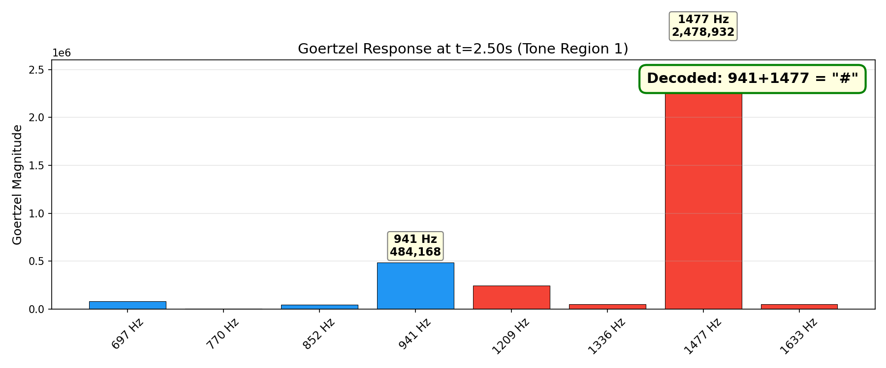

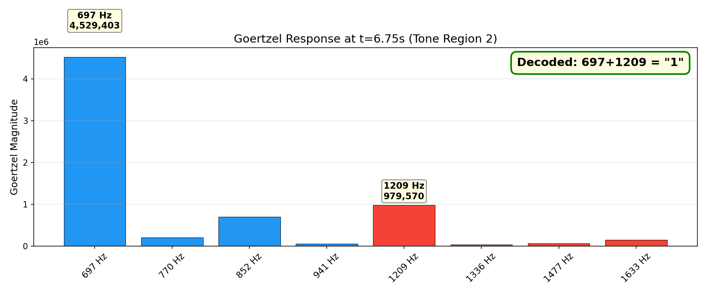

---

## Band Magnitude Comparison

FFT and Goertzel magnitudes for low vs high band across all windows.

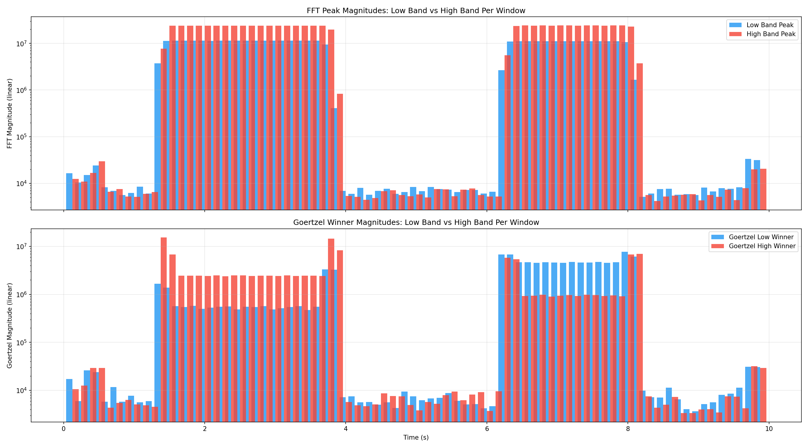

---

## Per-Window Detail Table (Active Windows Only)

| Time (s) | RMS (dBFS) | FFT Low (Hz) | FFT High (Hz) | FFT Digit | FFT Twist | Goertzel Low | Goertzel High | G Digit | G Twist |
|----------|-----------|---------------|----------------|-----------|-----------|--------------|---------------|---------|---------|

| 1.37 | -10.2 | 948.1 (3764669) | 1472.1 (7658095) | # | 2.0 | 941 Hz (1672447) | 1477 Hz (15287004) | # | 9.1 |

| 1.50 | -6.8 | 948.1 (11348374) | 1472.1 (23998136) | # | 2.1 | 941 Hz (1384692) | 1477 Hz (6820544) | # | 4.9 |

| 1.62 | -6.5 | 948.1 (11408172) | 1472.1 (24125672) | # | 2.1 | 941 Hz (572436) | 1477 Hz (2437271) | # | 4.3 |

| 1.75 | -6.5 | 948.1 (11395490) | 1472.1 (24135633) | # | 2.1 | 941 Hz (546140) | 1477 Hz (2457555) | # | 4.5 |

| 1.87 | -6.5 | 948.1 (11397463) | 1472.1 (24136696) | # | 2.1 | 941 Hz (579720) | 1477 Hz (2454489) | # | 4.2 |

| 2.00 | -6.5 | 948.1 (11391482) | 1472.1 (24136121) | # | 2.1 | 941 Hz (498627) | 1477 Hz (2421715) | # | 4.9 |

| 2.12 | -6.5 | 948.1 (11385289) | 1472.1 (24137184) | # | 2.1 | 941 Hz (528323) | 1477 Hz (2489757) | # | 4.7 |

| 2.25 | -6.5 | 948.1 (11410154) | 1472.1 (24120497) | # | 2.1 | 941 Hz (549086) | 1477 Hz (2391602) | # | 4.4 |

| 2.37 | -6.5 | 948.1 (11402372) | 1472.1 (24136441) | # | 2.1 | 941 Hz (562471) | 1477 Hz (2474779) | # | 4.4 |

| 2.50 | -6.5 | 948.1 (11389627) | 1472.1 (24148560) | # | 2.1 | 941 Hz (484168) | 1477 Hz (2478932) | # | 5.1 |

| 2.62 | -6.5 | 948.1 (11396019) | 1472.1 (24142126) | # | 2.1 | 941 Hz (555118) | 1477 Hz (2420938) | # | 4.4 |

| 2.75 | -6.5 | 948.1 (11402181) | 1472.1 (24132815) | # | 2.1 | 941 Hz (541888) | 1477 Hz (2460182) | # | 4.5 |

| 2.87 | -6.5 | 948.1 (11399221) | 1472.1 (24135855) | # | 2.1 | 941 Hz (571518) | 1477 Hz (2450447) | # | 4.3 |

| 3.00 | -6.5 | 948.1 (11406443) | 1472.1 (24132300) | # | 2.1 | 941 Hz (484793) | 1477 Hz (2411267) | # | 5.0 |

| 3.12 | -6.5 | 948.1 (11394612) | 1472.1 (24142755) | # | 2.1 | 941 Hz (514901) | 1477 Hz (2477580) | # | 4.8 |

| 3.25 | -6.5 | 948.1 (11403428) | 1472.1 (24142537) | # | 2.1 | 941 Hz (545981) | 1477 Hz (2411299) | # | 4.4 |

| 3.37 | -6.5 | 948.1 (11403170) | 1472.1 (24139406) | # | 2.1 | 941 Hz (571766) | 1477 Hz (2470710) | # | 4.3 |

| 3.50 | -6.5 | 948.1 (11393642) | 1472.1 (24141512) | # | 2.1 | 941 Hz (473204) | 1477 Hz (2467033) | # | 5.2 |

| 3.62 | -6.5 | 948.1 (11417085) | 1472.1 (24129407) | # | 2.1 | 941 Hz (550372) | 1477 Hz (2433151) | # | 4.4 |

| 3.75 | -8.0 | 948.1 (9419188) | 1472.1 (19828990) | # | 2.1 | 941 Hz (3312110) | 1477 Hz (14477446) | # | 4.4 |

| 3.87 | -13.3 | 948.1 (408719) | 1472.1 (835662) | # | 2.0 | 941 Hz (3287501) | 1477 Hz (8239145) | # | 2.5 |

| 6.25 | -10.8 | 700.1 (2682489) | 1216.1 (5533142) | 1 | 2.1 | 697 Hz (6771785) | 1209 Hz (5778319) | 1 | 1.2 |

| 6.37 | -7.1 | 700.1 (10919337) | 1216.1 (23705119) | 1 | 2.2 | 697 Hz (6815638) | 1209 Hz (5371417) | 1 | 1.3 |

| 6.50 | -6.5 | 700.1 (11125832) | 1216.1 (24157302) | 1 | 2.2 | 697 Hz (4654349) | 1209 Hz (923345) | 1 | 5.0 |

| 6.62 | -6.5 | 700.1 (11149435) | 1216.1 (24141570) | 1 | 2.2 | 697 Hz (4687287) | 1209 Hz (941205) | 1 | 5.0 |

| 6.75 | -6.5 | 700.1 (11088985) | 1216.1 (24184521) | 1 | 2.2 | 697 Hz (4529403) | 1209 Hz (979570) | 1 | 4.6 |

| 6.87 | -6.5 | 700.1 (11135435) | 1216.1 (24148423) | 1 | 2.2 | 697 Hz (4695646) | 1209 Hz (898436) | 1 | 5.2 |

| 7.00 | -6.5 | 700.1 (11113563) | 1216.1 (24168154) | 1 | 2.2 | 697 Hz (4622704) | 1209 Hz (934081) | 1 | 4.9 |

| 7.12 | -6.5 | 700.1 (11078846) | 1216.1 (24189815) | 1 | 2.2 | 697 Hz (4528875) | 1209 Hz (960401) | 1 | 4.7 |

| 7.25 | -6.5 | 700.1 (11145225) | 1216.1 (24146493) | 1 | 2.2 | 697 Hz (4717751) | 1209 Hz (923857) | 1 | 5.1 |

| 7.37 | -6.5 | 700.1 (11102356) | 1216.1 (24173847) | 1 | 2.2 | 697 Hz (4597625) | 1209 Hz (983064) | 1 | 4.7 |

| 7.50 | -6.5 | 700.1 (11096108) | 1216.1 (24178043) | 1 | 2.2 | 697 Hz (4599452) | 1209 Hz (966172) | 1 | 4.8 |

| 7.62 | -6.5 | 700.1 (11143246) | 1216.1 (24146166) | 1 | 2.2 | 697 Hz (4716396) | 1209 Hz (923590) | 1 | 5.1 |

| 7.75 | -6.5 | 700.1 (11093789) | 1216.1 (24181358) | 1 | 2.2 | 697 Hz (4529946) | 1209 Hz (955507) | 1 | 4.7 |

| 7.87 | -6.5 | 700.1 (11108924) | 1216.1 (24167703) | 1 | 2.2 | 697 Hz (4643050) | 1209 Hz (918582) | 1 | 5.1 |

| 8.00 | -7.3 | 700.1 (10662763) | 1216.1 (23029376) | 1 | 2.2 | 697 Hz (7739334) | 1209 Hz (6740439) | 1 | 1.1 |

| 8.12 | -11.2 | 700.1 (1670477) | 1216.1 (3722137) | 1 | 2.2 | 697 Hz (6169495) | 1209 Hz (6981896) | 1 | 1.1 |

---

## Tone Region Consensus Analysis

### Region 1: 1.37s – 4.00s (2.62s, 21 windows)

| Method | Low Freq | Count | High Freq | Count | Decoded Digit |
|--------|----------|-------|-----------|-------|---------------|
| FFT | 948.1 Hz (≈941 Hz) | 21/21 | 1472.1 Hz (≈1477 Hz) | 21/21 | **#** |
| Goertzel | 941 Hz | 21/21 | 1477 Hz | 21/21 | **#** |

- Average magnitude: Low = 10416038, High = 22030305
- Twist ratio: 2.1:1

### Region 2: 6.25s – 8.25s (2.00s, 16 windows)

| Method | Low Freq | Count | High Freq | Count | Decoded Digit |
|--------|----------|-------|-----------|-------|---------------|
| FFT | 700.1 Hz (≈697 Hz) | 16/16 | 1216.1 Hz (≈1209 Hz) | 16/16 | **1** |
| Goertzel | 697 Hz | 16/16 | 1209 Hz | 16/16 | **1** |

- Average magnitude: Low = 9957301, High = 21623323
- Twist ratio: 2.2:1

---

## Energy-Gated DTMF Detection (Fixed Algorithm)

- **Noise floor (95th pctile Goertzel in noise windows):** 29373
- **Absolute threshold (10× noise):** 293734
- **Energy gate:** -20.0 dBFS
- **Max twist ratio:** 4.0

**Detected sequence:** `#11`

| Digit | Start | End | Duration |
|-------|-------|-----|----------|

| # | 3.87s | 4.00s | 0.12s |

| 1 | 6.25s | 6.50s | 0.25s |

| 1 | 8.00s | 8.25s | 0.25s |

---

## Diagnostics

### Goertzel Signal-to-Noise

Max Goertzel magnitude in noise windows: 32,033. Min Goertzel magnitude in active windows: 2,391,602. SNR ratio: 74.7x. Any threshold below 32,033 will cause false detections in noise.

### Threshold Bug — Why Noise Windows Detect DTMF

In a noise window at t=5.37s: peak amplitude = 322, 10% threshold = 32, 30% threshold = 97, but max Goertzel magnitude = 7,983. Goertzel output is 248x above 10% threshold and 83x above 30% threshold. Goertzel output scales as ~N/2 * amplitude (N=5512 → 2756x amplification). Using peak_amplitude * percentage as threshold guarantees false detections in any window with non-zero signal.

### Frequency Consistency in Active Windows

FFT low-band peaks: {948.1: 21, 700.1: 16}. FFT high-band peaks: {1472.1: 21, 1216.1: 16}. Goertzel low winner: {941: 21, 697: 16}. Goertzel high winner: {1477: 21, 1209: 16}. 

---

**Input File:** `C:\Users\Jumper\Projects\bowie-phone\logs\bowie-phone.csv`  
**Generated:** February 13, 2026