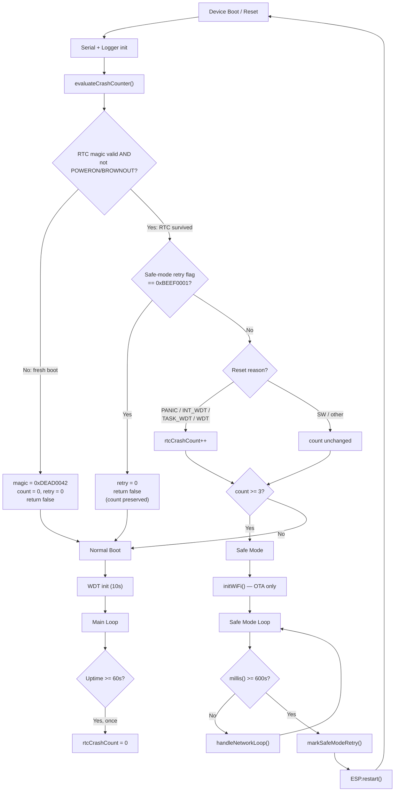

# Crash Counter & Safe Mode System

## Purpose

Protect against boot loops caused by bad firmware or configuration. If the device
crashes N times in a row without ever stabilising, it enters a minimal **safe mode**
that only runs WiFi + OTA, giving a window to push a fix remotely.

## Architecture Overview

```
┌─────────────────────────────────────────────────────────────────────┐
│                          Device Boot                                │
│                                                                     │
│  1. evaluateCrashCounter()   ← reads RTC_NOINIT_ATTR memory        │
│  2. if crash count ≥ 3  →  SAFE MODE  (WiFi + OTA only)            │
│  3. else                 →  NORMAL BOOT (full phone init)           │
│                                                                     │
│  Normal boot:                                                       │
│    - WDT enabled (10 s panic timeout)                               │
│    - After 60 s stable uptime → crash counter cleared               │
│                                                                     │
│  Safe mode:                                                         │
│    - Retry normal boot after 10 min                                 │
│    - OTA always available for emergency reflash                     │
└─────────────────────────────────────────────────────────────────────┘
```

## RTC Memory Variables

All three are `RTC_NOINIT_ATTR` — they survive soft resets (panic, WDT) but
contain garbage after power-on or brownout.

| Variable           | Type       | Purpose                                      |
|--------------------|------------|----------------------------------------------|
| `rtcCrashMagic`    | `uint32_t` | Sentinel (`0xDEAD0042`) validates stored data |
| `rtcCrashCount`    | `uint32_t` | Consecutive crash-type resets since last stable run |
| `rtcSafeModeRetry` | `uint32_t` | Flag (`0xBEEF0001`) = next boot should attempt normal startup |

## Tuning Constants

| Define                     | Default   | Description |
|----------------------------|-----------|-------------|
| `CRASH_SAFE_MODE_THRESHOLD`| 3         | Crashes before entering safe mode |
| `CRASH_STABILITY_MS`       | 60 000 ms | Uptime required to consider a boot "stable" |
| `SAFE_MODE_REBOOT_MS`      | 600 000 ms| Time in safe mode before retrying normal boot |

All are `#ifndef`-guarded in `crash_counter.h` and can be overridden via
`build_flags` in `platformio.ini`.

---

## Flow Diagram



## Detailed Walk-through

### 1. `evaluateCrashCounter()` — called once in `setup()`

1. **Magic check**: If `rtcCrashMagic != 0xDEAD0042` OR the reset was
   `ESP_RST_POWERON` / `ESP_RST_BROWNOUT`, initialise all three RTC vars to
   zero. Return `false` (normal boot). This handles: first ever boot, power
   cycle, brown-out recovery.

2. **Safe-mode retry**: If `rtcSafeModeRetry == 0xBEEF0001`, clear it and
   return `false`. The crash counter is *not* reset — if this retry also
   crashes, the count increments and safe mode re-engages.

3. **Crash-type increment**: For `ESP_RST_PANIC`, `ESP_RST_INT_WDT`,
   `ESP_RST_TASK_WDT`, `ESP_RST_WDT` — increment `rtcCrashCount`.
   - `ESP_RST_SW` and others: counter preserved, not incremented.

4. **Threshold check**: Return `rtcCrashCount >= CRASH_SAFE_MODE_THRESHOLD`.

### 2. Safe Mode Path (`setup()`)

When `evaluateCrashCounter()` returns `true`:

- `initNotifications()` — LED feedback only
- KEY3 hardware check — allows entering firmware update mode even during safe mode
- `initWiFi()` — no callback (no audio download), just WiFi + OTA
- `return` — skips Audio, Phone, Goertzel, WDT init, everything heavy

### 3. Safe Mode Loop (`loop()`)

`tickSafeMode()` returns `true` every iteration:
- Services `handleNetworkLoop()` at 100 ms intervals (OTA, telnet, web server)
- When `millis() >= SAFE_MODE_REBOOT_MS` (10 min), calls `markSafeModeRetry()`
  then `ESP.restart()` — producing an `ESP_RST_SW` reset

### 4. Retry Cycle

The `ESP_RST_SW` reset from safe mode lands back in `evaluateCrashCounter()`:
- Magic is valid, reason is `ESP_RST_SW` → counter **not** incremented
- Retry flag is set → cleared, returns `false` → **normal boot attempted**
- If this boot crashes, the crash is WDT/PANIC → counter increments past
  threshold again → right back into safe mode

### 5. Normal Boot — Watchdog Timer (WDT)

After all heavy init completes:
```cpp
esp_task_wdt_init(10, true);   // 10-second timeout, panic on expiry
esp_task_wdt_add(NULL);        // Add loopTask (Arduino main loop)
```

Every `loop()` iteration calls `esp_task_wdt_reset()`. If the main loop hangs
for >10 seconds, the WDT fires `ESP_RST_TASK_WDT` which feeds the crash counter.

**WDT is disabled before long operations:**
- OTA flash write (`esp_task_wdt_delete(NULL)` in `ArduinoOTA.onStart` and HTTP upload handler)
- Pull-based OTA (`performPullOTA()`)

### 6. Stability Check — `tickCrashStabilityCheck()`

Called every ~100 ms from the maintenance block:
```cpp
if (!crashCounterCleared && millis() >= CRASH_STABILITY_MS) {
    rtcCrashCount = 0;
    crashCounterCleared = true;
}
```

Once the device has been running 60 seconds without crashing, the counter resets
to zero. Any future crash starts the count fresh.

---

## Bug Analysis

### BUG 1 (Medium): Safe mode has no WDT — can hang forever

**Location:** `setup()` in `main.ino` — safe mode path returns before `esp_task_wdt_init`.

**Scenario:** Safe mode calls `initWiFi()`, which initialises WiFi, OTA, and
a web server. If any of those hang (bad WiFi driver state after repeated crashes,
`server.handleClient()` stuck in a loop, etc.), the device hangs indefinitely
with no watchdog to recover it. The 10-minute retry timer in `tickSafeMode()`
never fires because `loop()` never runs.

**Impact:** Defeats the entire purpose of safe mode — the device is bricked until
physically power-cycled.

**Fix:** Add WDT init before or right after `initWiFi()` in the safe mode path:
```cpp
if (inSafeMode) {
    // ... existing code ...
    initWiFi();
    esp_task_wdt_init(15, true);  // Longer timeout for safe mode
    esp_task_wdt_add(NULL);
    Logger.println("🛡️ Safe mode ready — OTA at /update, retry timer running");
    return;
}
```
And add `esp_task_wdt_reset()` in the safe mode loop path.

---

### BUG 2 (Medium): Safe-mode retry preserves crash count — can't escape a 2-crash scenario

**Location:** `evaluateCrashCounter()` — retry branch.

**Scenario:** Device crashes twice (count = 2), then crashes a third time →
safe mode. After 10 min, safe mode retries. The retry clears the retry flag but
**does not reset `rtcCrashCount`** (it stays at 3). If the retry succeeds and
runs for 60 s, `tickCrashStabilityCheck()` clears it — fine. But if the bug that
caused the crashes is intermittent and triggers at, say, 45 seconds, the device
crashes again. This time `evaluateCrashCounter()` sees count 3 → increments to 4
→ immediate safe mode again, *without the user getting a chance to interact*.

**Impact:** For intermittent bugs that crash within 60 s, the device enters an
infinite safe-mode ↔ single-retry cycle. The user never gets a window to OTA
during the normal boot because it re-enters safe mode immediately.

**This is actually correct by design** — the retry is meant as a single probe.
If the probe crashes, safe mode is the right place to be. But consider:
- Adding a telnet/serial command to force-clear the crash counter
- Or increasing `CRASH_STABILITY_MS` to be configurable per-retry

---

### BUG 3 (Low): `tickSafeMode()` uses absolute `millis()` — no uptime reference

**Location:** `tickSafeMode()` line: `if (millis() >= SAFE_MODE_REBOOT_MS)`

**Scenario:** `millis()` starts at 0 on every boot. Since safe mode is entered
early in `setup()`, this effectively measures "time since boot" which is the
intended behavior. **However**, if `millis()` wraps at ~49.7 days (unlikely
for 10-min timeout) or if boot takes significant time (WiFi connection can
take 10-30 seconds), the timer starts from 0 not from when safe mode was ready.

**Impact:** Minor — boot time is small relative to 600 s. Not a real bug, but
worth noting the assumption.

---

### BUG 4 (Medium): `ESP_RST_SW` doesn't increment but also doesn't clear

**Location:** `evaluateCrashCounter()` switch default case.

**Scenario:** If someone manually restarts the device via serial command
(`esp_restart()`) or through the web UI, the reset reason is `ESP_RST_SW`.
The crash counter is *preserved* but not incremented. This means if you had
2 crashes, then did a manual restart, the counter stays at 2. One more crash
→ safe mode. The manual restart didn't "reset" anything.

**Impact:** Manual restarts don't clear crash history. Only 60 s of stable
uptime clears it. This is arguably correct (preserving evidence) but could
surprise a user who expects a manual restart to "fix" things.

**Possible fix:** Clear the counter on `ESP_RST_SW` if desired:
```cpp
case ESP_RST_SW:
    rtcCrashCount = 0;  // Intentional restart = clean slate
    break;
```

---

### BUG 5 (High): `enterFirmwareUpdateMode()` from safe mode just calls `esp_restart()` — loops back to safe mode

**Location:** `setup()` safe mode path → `enterFirmwareUpdateMode()` →
`debug_commands.cpp` → `esp_restart()`.

**Scenario:** User holds KEY3 during boot while in safe mode. The code calls
`enterFirmwareUpdateMode()`, which disconnects WiFi and calls `esp_restart()`.
This produces `ESP_RST_SW`. On the next boot, `evaluateCrashCounter()` sees:
- Magic valid ✓
- Not retry flag (retry was never set) ✗
- `ESP_RST_SW` → counter preserved, not incremented
- Counter still ≥ 3 → **safe mode again**

The KEY3 "escape hatch" doesn't work in safe mode. It just reboots
back into safe mode because the crash counter is still above threshold.

**Impact:** The hardware firmware update escape hatch is broken when you need
it most — during a crash loop.

**Fix:** Either `markSafeModeRetry()` before the `esp_restart()` in the safe
mode KEY3 path, or reset the crash counter:
```cpp
if (digitalRead(FIRMWARE_UPDATE_KEY) == LOW) {
    Logger.println("🔧 KEY3 held — entering firmware update mode...");
    rtcCrashCount = 0;  // Clear counter so next boot is normal
    enterFirmwareUpdateMode();
}
```

---

### BUG 6 (Low): WDT `esp_task_wdt_delete(NULL)` in OTA doesn't re-add after failure

**Location:** `wifi_manager.cpp` — OTA error callback.

**Scenario:** OTA starts → WDT deleted → OTA fails → error callback runs →
`esp_restart()`. The restart handles it (WDT re-init on next boot). But if OTA
fails *without* triggering `esp_restart()` (e.g., a network timeout that doesn't
call the error handler), the main loop continues with **no watchdog protection**.

**Impact:** After a failed OTA that doesn't restart, the device runs without
WDT protection indefinitely down to the next reboot.

**Possible fix:** Re-add the WDT on OTA failure paths that don't restart:
```cpp
esp_task_wdt_add(NULL);  // Restore watchdog
```

---

## Reset Reason → Counter Behavior Truth Table

| Reset Reason       | Counter Action | Enters Safe Mode? |
|--------------------|---------------|-------------------|
| `ESP_RST_POWERON`  | Reset to 0    | No                |
| `ESP_RST_BROWNOUT` | Reset to 0    | No                |
| `ESP_RST_PANIC`    | Increment     | If count ≥ 3      |
| `ESP_RST_TASK_WDT` | Increment     | If count ≥ 3      |
| `ESP_RST_INT_WDT`  | Increment     | If count ≥ 3      |
| `ESP_RST_WDT`      | Increment     | If count ≥ 3      |
| `ESP_RST_SW`       | Preserve      | If count ≥ 3      |
| `ESP_RST_DEEPSLEEP`| Preserve      | If count ≥ 3      |
| (retry flag set)   | Preserve      | No (retry once)   |

## Source Files

| File | Role |
|------|------|
| `include/crash_counter.h` | API declarations, threshold constants |
| `src/crash_counter.cpp` | RTC memory management, all four public functions |
| `src/main.ino` | Integration: calls evaluate in setup, tick in loop |
| `src/wifi_manager.cpp` | WDT disable during OTA operations |
| `src/commands/debug_commands.cpp` | `enterFirmwareUpdateMode()` definition |
